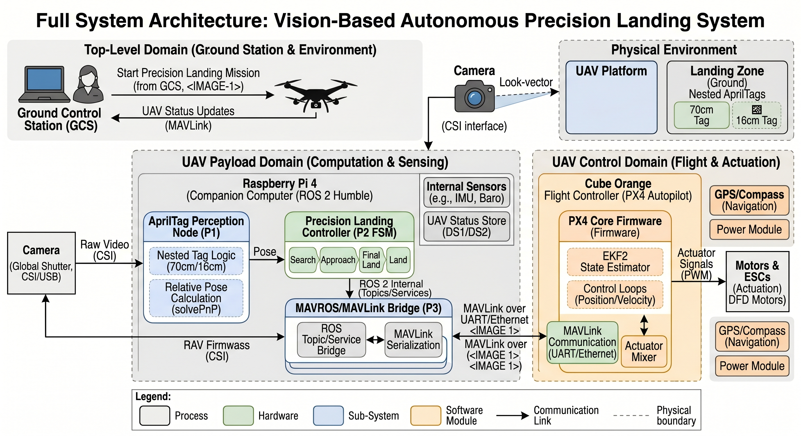

# FARASHA UAV Precision Landing System

<p align="center">
  
</p>

> Autonomous precision landing for UAVs using nested AprilTag detection,
> PX4 autopilot, and a 5-state ROS2 FSM companion controller.
> Developed as a PFE (Final Year Project) at FARASHA Systems × TAMAYOUZ Centre FSA.

---

## Features

- **Nested AprilTag detection** — outer 70 cm tag for high-altitude,
  inner 15 cm tag for close-range handoff
- **4-stage filter pipeline** — quality gate, outlier rejection,
  EMA smoothing, target-lost failsafe
- **5-state FSM** — SEARCHING → ALIGNING → DESCENDING → FLARE → LANDING
- **SITL-validated** — Gazebo 8, PX4 SITL, ROS2 Jazzy, MAVProxy
- **HITL-ready** — Raspberry Pi 4, PiCamera V2.1, Cube Orange via UART
- **MAVLink LANDING_TARGET** stream at 30 Hz

---

## System Architecture

```
┌─────────────────────────────────────────────────────────────┐
│                  Companion Computer (RPi 4)                  │
│                                                              │
│  PiCamera V2.1                                              │
│      ↓ 30Hz                                                 │
│  apriltag_detector ──→ /apriltag/pose                       │
│                    ──→ /apriltag/confidence                  │
│                    ──→ /apriltag/debug_image                 │
│                         ↓                                    │
│  landing_target_publisher ─────────────── LANDING_TARGET    │
│  precision_landing_controller ──────────── SET_POSITION ────┼──UART──→ Cube Orange
│      FSM: IDLE→SEARCHING→ALIGNING→                          │           PX4
│           DESCENDING→FLARE→LANDING                           │
└─────────────────────────────────────────────────────────────┘
```

---

## Quick Start

### SITL (Simulation)

```bash
# 1. Clone the repository
git clone https://github.com/YOUR_USERNAME/farasha-uav-precision-landing
cd farasha-uav-precision-landing

# 2. Build the ROS2 package
cd ros2_ws
colcon build --symlink-install
source install/setup.bash

# 3. Set up the Gazebo world
cp simulation/models/apriltag \
   ~/PX4-Autopilot/Tools/simulation/gz/models/ -r
cp simulation/models/farasha_nested_tag \
   ~/PX4-Autopilot/Tools/simulation/gz/models/ -r
cp simulation/worlds/apriltag.sdf \
   ~/PX4-Autopilot/Tools/simulation/gz/worlds/

# 4. Launch full SITL stack
bash scripts/sitl/launch_sitl.sh
```

### HITL (Real Hardware)

```bash
# On RPi 4 Ubuntu 24
bash scripts/hitl/launch_hitl.sh
```

---

## State Machine

```
IDLE ──(tag detected for 3 frames)──→ SEARCHING
SEARCHING ──(2s keepalive)──→ OFFBOARD mode ──(tag visible)──→ ALIGNING
ALIGNING ──(xy_err < 0.15m)──→ DESCENDING
DESCENDING ──(alt < 0.5m)──→ FLARE
FLARE ──(alt < 0.12m × 5 frames)──→ LANDING
LANDING ──(disarmed OR alt < 0.15m)──→ LANDED
```

---

## Tag Layout

```
┌──────────────────────────────────────┐
│   Outer: tag36h11 ID=0  (70 cm)      │
│   ┌──────────────────────┐           │
│   │  Inner: tag36h11     │           │
│   │  ID=1  (15 cm)       │           │
│   └──────────────────────┘           │
└──────────────────────────────────────┘
```

---

## Hardware

| Component | Spec |
|-----------|------|
| Flight controller | Cube Orange — PX4 |
| Companion computer | Raspberry Pi 4B (4 GB) |
| Camera | PiCamera V2.1 (IMX219) — 1080p |
| UART link | `/dev/ttyAMA0` @ 921600 baud |
| MAVLink frame | `MAV_FRAME_LOCAL_NED` |

---

## ROS2 Topics

| Topic | Type | Description |
|-------|------|-------------|
| `/apriltag/pose` | `PoseStamped` | Tag pose in camera frame |
| `/apriltag/confidence` | `Float32` | Detection quality [0–1] |
| `/apriltag/debug_image` | `Image` | HUD with overlay |
| `/apriltag/status` | `String` | Detection status string |
| `/landing/state` | `String` | Current FSM state |
| `/landing/active` | `Bool` | Landing sequence active |
| `/landing/command` | `String` | FORCE_START / ABORT / RESET |

---

## MAVLink Parameters

| Parameter | Value | Description |
|-----------|-------|-------------|
| `LTEST_MODE` | 1 | Stationary landing pad |
| `RTL_PLD_MD` | 1 | Opportunistic precision landing |
| `MPC_LAND_SPEED` | 0.4 m/s | Final descent rate |
| `PLD_HACC_RAD` | 0.2 m | Horizontal accuracy radius |
| `PLD_BTOUT` | 5.0 s | Estimator timeout |
| `PLD_FAPPR_ALT` | 0.5 m | Final approach altitude |

---

## Filter Pipeline

```
Raw detection (pyapriltags)
    ↓
[1] Quality gate       — margin < 30 → REJECT
    ↓
[2] Spatial gate       — jump > 2.0m → REJECT
    ↓
[3] EMA smoother       — α=0.3, low-pass filter
    ↓
[4] Target-lost guard  — 0.5s timeout → halt MAVLink TX
    ↓
Filtered (x, y, z) → LANDING_TARGET @ 30 Hz
```

---

## Repository Structure

```
farasha-uav-precision-landing/
├── ros2_ws/src/farasha_landing/    # ROS2 package
├── simulation/worlds/              # Gazebo SDF world
├── simulation/models/              # AprilTag models
├── scripts/sitl/                   # SITL launch scripts
├── scripts/hitl/                   # HITL launch scripts
├── config/                         # PX4 params, camera intrinsics
└── docs/                           # Architecture, setup guides
```

---

## Author

**ELMESSAOUDI Oussama** — PFE Intern  
FARASHA Systems × TAMAYOUZ Centre FSA × UIZ  
`oussama.elmessaoudi@farasha.systems`

---

## License

MIT License — see `LICENSE`
